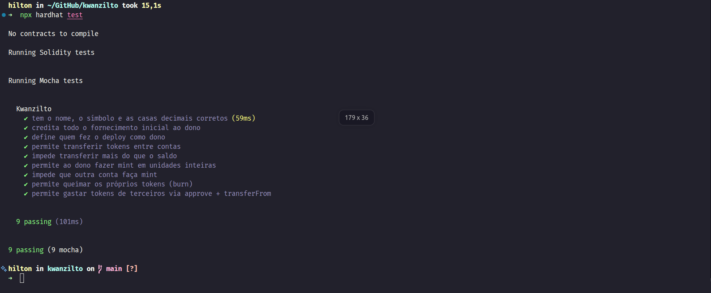
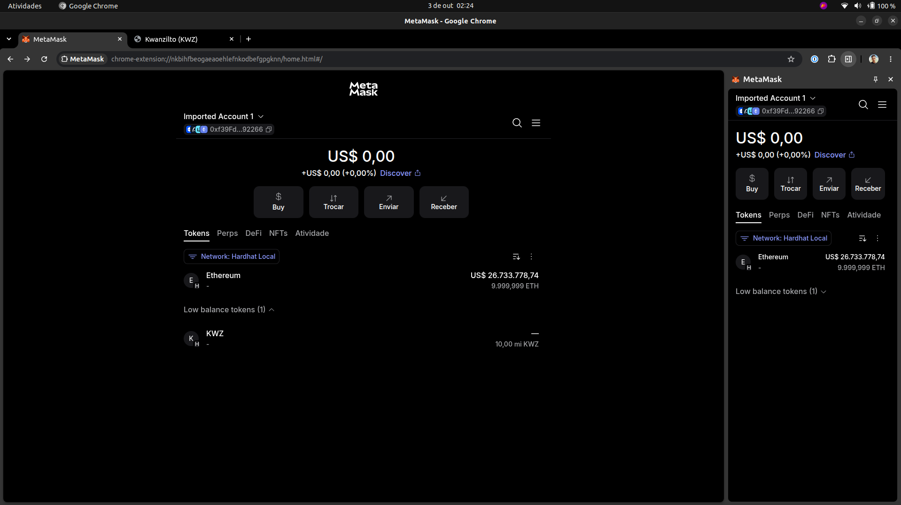
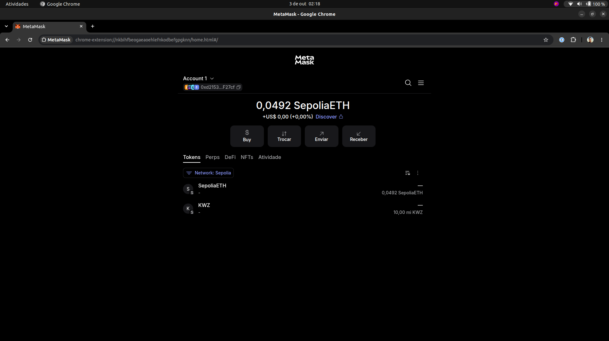
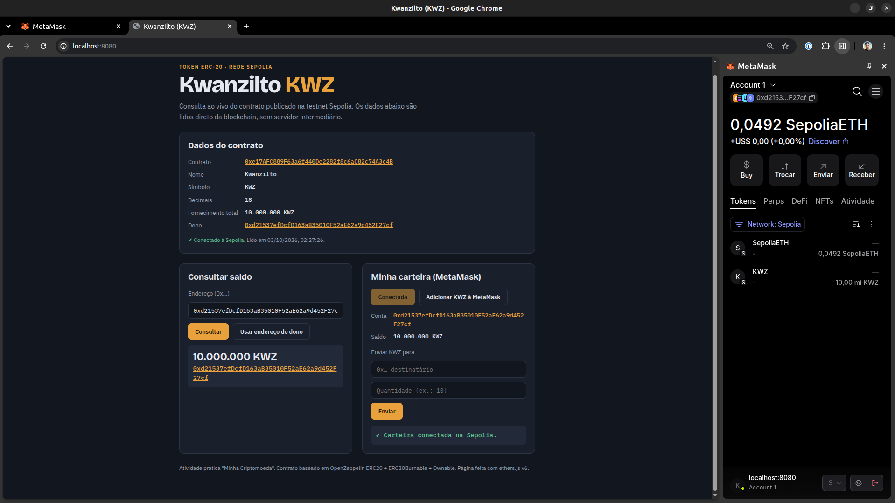

# Kwanzilto (KWZ): Minha Criptomoeda

Atividade prática "Minha Criptomoeda (Token ERC-20)": criação, testes e deploy de um token fungível ERC-20 usando Hardhat 3, ethers.js e OpenZeppelin Contracts.

**Aluno:** José Hilton Ribeiro Eufrasio

| | |
|---|---|
| Nome do token | Kwanzilto |
| Símbolo | KWZ |
| Casas decimais | 18 |
| Fornecimento inicial | 10.000.000 KWZ |
| Rede | Sepolia (chain ID 11155111) |
| Endereço do contrato | [`0xe17AFC889F63a6f440De2282f8c6aC82c74A3c4B`](https://sepolia.etherscan.io/address/0xe17AFC889F63a6f440De2282f8c6aC82c74A3c4B) |
| Dono (conta do deploy) | [`0xd21537EfDcfD163aB35010F52aE62a9d452F27Cf`](https://sepolia.etherscan.io/address/0xd21537EfDcfD163aB35010F52aE62a9d452F27Cf) |
| Transação de deploy | [`0x2141437a…f50510ac`](https://sepolia.etherscan.io/tx/0x2141437a5220d8182639c0fab0f47b7eb668efa72c7276e08148fcd9f50510ac) (bloco 11811151) |

---

## Checklist de evidências

| Evidência pedida | Onde está |
|---|---|
| Código-fonte com nome, símbolo e fornecimento personalizados | [`contracts/Kwanzilto.sol`](contracts/Kwanzilto.sol) e [`ignition/modules/Kwanzilto.ts`](ignition/modules/Kwanzilto.ts) |
| Print do `npx hardhat test` com todos os testes passando | [Print](#testes) abaixo · saída em texto: [`entrega/saida-testes.txt`](entrega/saida-testes.txt) |
| Endereço do contrato implantado | `0xe17AFC889F63a6f440De2282f8c6aC82c74A3c4B` |
| Print do saldo do token na MetaMask | [Prints](#metamask) abaixo (rede local e Sepolia) |
| Link do contrato no Sepolia Etherscan | https://sepolia.etherscan.io/address/0xe17AFC889F63a6f440De2282f8c6aC82c74A3c4B |
| Parágrafo explicando as escolhas | [Escolhas feitas](#escolhas-feitas) abaixo |

## Escolhas feitas

Batizei o token de **Kwanzilto**, com o símbolo **KWZ** (três letras do próprio nome). O fornecimento inicial é de **10.000.000 KWZ**, dez vezes o do modelo, todo creditado à conta do deploy, a única que pode emitir novos tokens (`Ownable`). Como extras, implementei o **burn** (`ERC20Burnable`), que deixa cada titular queimar os próprios tokens, e uma **página HTML com ethers.js** que consulta o saldo de qualquer endereço na Sepolia. Também ampliei os testes de 4 para 9.

---

## O contrato

```solidity
// SPDX-License-Identifier: MIT
pragma solidity ^0.8.24;

import "@openzeppelin/contracts/token/ERC20/ERC20.sol";
import "@openzeppelin/contracts/token/ERC20/extensions/ERC20Burnable.sol";
import "@openzeppelin/contracts/access/Ownable.sol";

contract Kwanzilto is ERC20, ERC20Burnable, Ownable {
    constructor(uint256 fornecimentoInicial)
        ERC20("Kwanzilto", "KWZ")
        Ownable(msg.sender)
    {
        _mint(msg.sender, fornecimentoInicial * 10 ** decimals());
    }

    // permite ao dono (quem fez o deploy) criar mais tokens depois
    function mint(address destinatario, uint256 quantidade) public onlyOwner {
        _mint(destinatario, quantidade * 10 ** decimals());
    }
}
```

- `ERC20` (OpenZeppelin) implementa todo o padrão: `transfer`, `approve`, `allowance`, `transferFrom`, `balanceOf`, `totalSupply` e os eventos `Transfer` e `Approval`.
- `Ownable(msg.sender)` define quem fez o deploy como dono; `onlyOwner` restringe o `mint` a essa conta.
- `ERC20Burnable` (desafio extra) adiciona `burn` e `burnFrom`.
- O construtor e o `mint` recebem quantidades em unidades inteiras e multiplicam por `10 ** decimals()` (10¹⁸).

## Testes

Arquivo: [`test/Kwanzilto.ts`](test/Kwanzilto.ts) (Mocha + Chai + ethers.js, usando `network.create()` e `loadFixture`).

| # | Teste | O que verifica |
|---|---|---|
| 1 | tem o nome, o símbolo e as casas decimais corretos | `name`, `symbol`, `decimals` |
| 2 | credita todo o fornecimento inicial ao dono | saldo do dono = 10.000.000 × 10¹⁸ = `totalSupply` |
| 3 | define quem fez o deploy como dono | `owner()` |
| 4 | permite transferir tokens entre contas | saldo + evento `Transfer` |
| 5 | impede transferir mais do que o saldo | reverte com `ERC20InsufficientBalance` |
| 6 | permite ao dono fazer mint em unidades inteiras | saldo e `totalSupply` aumentam |
| 7 | impede que outra conta faça mint | reverte com `OwnableUnauthorizedAccount(conta)` |
| 8 | permite queimar os próprios tokens (burn) | saldo e `totalSupply` diminuem |
| 9 | permite gastar tokens de terceiros via approve + transferFrom | evento `Approval`, transferência e allowance consumida |



## Deploy

Módulo do Hardhat Ignition: [`ignition/modules/Kwanzilto.ts`](ignition/modules/Kwanzilto.ts), com o parâmetro `fornecimentoInicial` (padrão 10.000.000).

**Caminho A (local):** `npx hardhat node` + `npx hardhat ignition deploy ignition/modules/Kwanzilto.ts --network localhost`. Endereço obtido: `0x5FbDB2315678afecb367f032d93F642f64180aa3` (rede local, temporária).

**Caminho B (Sepolia):** Alchemy como nó RPC e credenciais guardadas no Hardhat Keystore (`SEPOLIA_RPC_URL` e `SEPOLIA_PRIVATE_KEY`, lidas via `configVariable` no [`hardhat.config.ts`](hardhat.config.ts)). Nenhum segredo está no repositório.

```bash
npx hardhat ignition deploy ignition/modules/Kwanzilto.ts --network sepolia
```

O registro do deploy está em [`ignition/deployments/chain-11155111/`](ignition/deployments/chain-11155111/).

### Verificação on-chain

O script [`scripts/verificar-sepolia.ts`](scripts/verificar-sepolia.ts) lê o contrato direto da Sepolia (sem chave privada) e confere rede, bytecode, nome, símbolo, decimais, fornecimento, dono e a transação de deploy. Resultado ([`entrega/verificacao-sepolia.txt`](entrega/verificacao-sepolia.txt)):

```
✔ Rede: chain ID 11155111 (Sepolia)
✔ Contrato existe: 0xe17AFC889F63a6f440De2282f8c6aC82c74A3c4B (2652 bytes de bytecode)
✔ Nome: Kwanzilto
✔ Símbolo: KWZ
✔ Decimais: 18
✔ Fornecimento total: 10000000.0 KWZ
✔ Dono: 0xd21537efDcfD163aB35010F52aE62a9d452F27cf
✔ Saldo do dono: 10000000.0 KWZ
✔ Transação de deploy: 0x2141437a5220d8182639c0fab0f47b7eb668efa72c7276e08148fcd9f50510ac (bloco 11811151)

Tudo certo.
```

## MetaMask

Rede local (Hardhat Local, chain ID 31337):



Sepolia:



## Página web (desafio extra)

[`docs/index.html`](docs/index.html): página com ethers.js v6 que lê o contrato na Sepolia e permite:

- ver nome, símbolo, decimais, fornecimento e dono;
- consultar o saldo de qualquer endereço (funciona sem carteira, usando um nó público);
- conectar a MetaMask, ver o próprio saldo, adicionar o KWZ à carteira e enviar tokens.

Página publicada: _(link do GitHub Pages)_



---

## Como rodar

Pré-requisito: Node.js 22 ou superior.

```bash
npm install
npx hardhat test                 # roda os 9 testes
npm run verificar:sepolia        # confere o contrato publicado na Sepolia
npm run pagina                   # abre a página web em http://localhost:8080
```

## Estrutura

```
contracts/Kwanzilto.sol                 contrato do token
test/Kwanzilto.ts                       testes em TypeScript
ignition/modules/Kwanzilto.ts           módulo de deploy (Hardhat Ignition)
ignition/deployments/chain-11155111/    registro do deploy na Sepolia
scripts/verificar-sepolia.ts            verificação on-chain do deploy
docs/index.html                         página web (desafio extra)
entrega/                                prints e saídas usados como evidência
hardhat.config.ts                       configuração (rede sepolia via Keystore)
```
